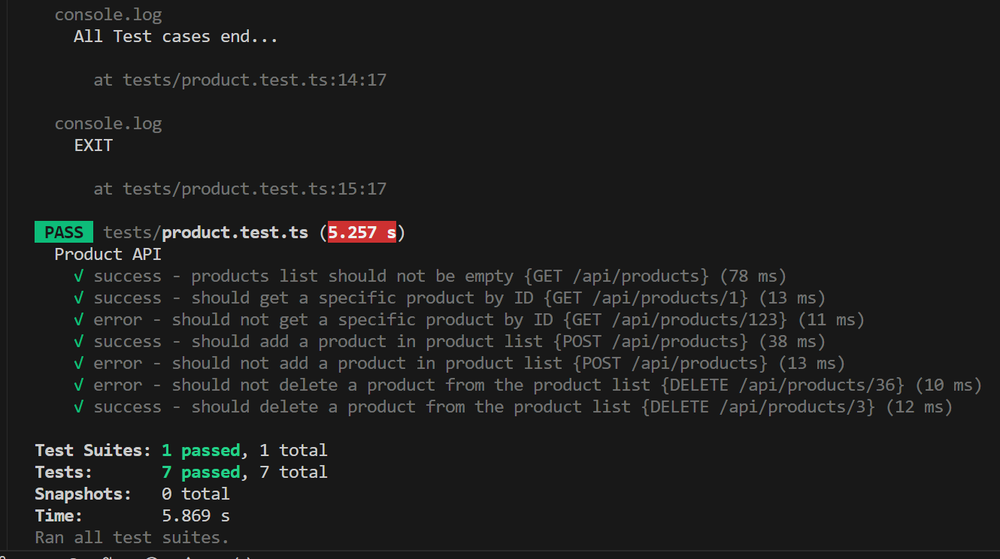
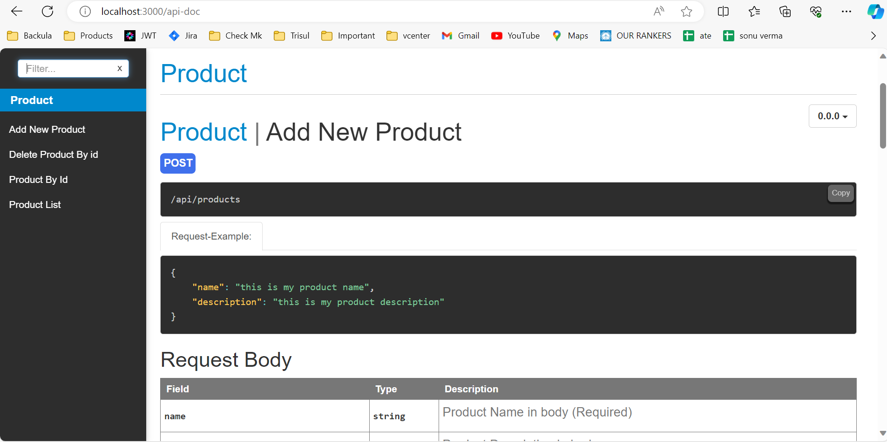

1. git clone https://github.com/sonu517825/return-journey.git

2. cd ./return-journey

# TASK 1 

3. cd ./javascript

4. npm run task1 { make sure you are in javascript dir }

# TASK 2

5. npm run task2 { make sure you are in javascript dir }

# TASK 3

6. npm run task3 { make sure you are in javascript dir }

# TASK 4

7. cd ..

8. cd ./nodejstypescript

9. npm i { make sure you are in nodejstypescript dir }

10. npm start || npm run dev { make sure your host and port is free & you are in nodejstypescript dir }

11. import postman collection { optional }

* BASE URL  http://{host}:{port} 

  ex =>  http://localhost:3000

* APIs
    GET /api/products
    GET /api/products/:id
    POST /api/products
    DELETE /api/products/:id

* Make Sure your baseurl should be same

# TASK 5

12. run your apis { middleware resp [2023-12-24T19:15:45.926Z] GET /api/products }

# TASK 6 

13. npm test { make sure you are in nodejstypescript dir }

RESP : 

# TASK 7

14. /api-doc { run this endpoint for documentation ex. http://localhost:3000/api-doc }

RESP : 

Still if you face any problem please reach out to me

Email : sonu9506517825@gmail.com

Linkedin : https://www.linkedin.com/in/sonu-verma-64898520a/
